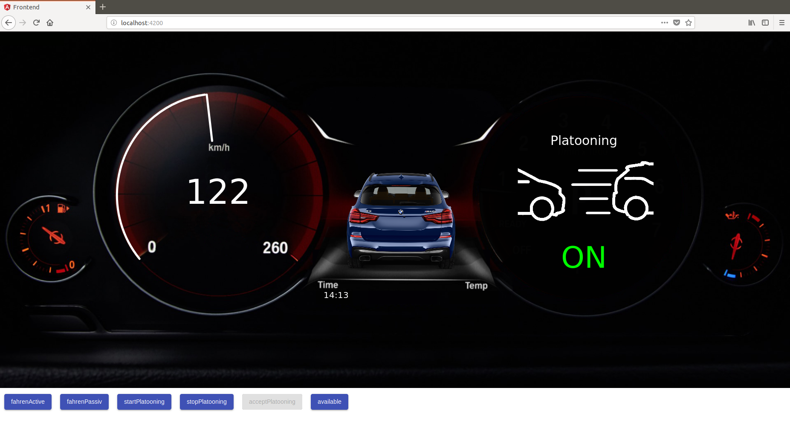

## Mobi
This repository shows the possibility of using blockchain technology in the context of a car platooning.
It shows how to perform transactions to compensate the first vehicle automatically via the IOTA Tangle. In addition, the current status of the platooning is written to the tangle due to its traceability and transparency. For better illustration, we have implemented this on self-constructed autonomously driving cars that platoons on a defined course and exchange transactions via the IOTA tangle.

In this repository there is Arduino code to let the self-built cars drive autonomously. It also contains NodeJ's code, which manages the platooning and communicates with the IOTA Tangle, listens for transactions and sends transactions.


## Screenshots


## Installation
1. Install Compass from https://github.com/iotaledger/compass
2. Open all remote options of IRI set PORT to 14265, enable ZMQ and set the ZMQ_PORT to 5555
3. Replace the snapshot.txt with the following line
```
RPP9FILTOTIVUVXTAFIZCMXABKLXFIJY9NUPC9XWWCXEIIQXBCSNS9DYTRAJJIGDVPNOABWDQDVTADBLC;2779530283277761
```
This allocates all token supply to seed
```
SEEDB9999999999999999999999999999999999999999999999999999999999999999999999999999
```
4. Install Angular-CLI  
  ```
$npm i @angular/cli
  ```
4. Setup and install
```
$ clone https://github.com/MatthiasBabel/mobi
$ cd mobi
$ npm install
$ cd frontend
$ npm install
$ cd ..
$ nano src/config.json
```
5. Configure IPs if you run both platooning participants on one device use 127.0.0.1 otherwise use the respective IPs of the devices
```
$ nano src/config.json
$ nano frontend/src/app/site/config.json
```

## Run it
```
$ node src/passivePlatooning.js
$ node src/activePlatooning.js
$ cd frontend
$ ng serve
```
Now you are able to simulate the platooning payments on your browser.
For simplicity you control both participants


## Credits
Give proper credits. This could be a link to any repo which inspired you to build this project, any blogposts or links to people who contributed in this project.
